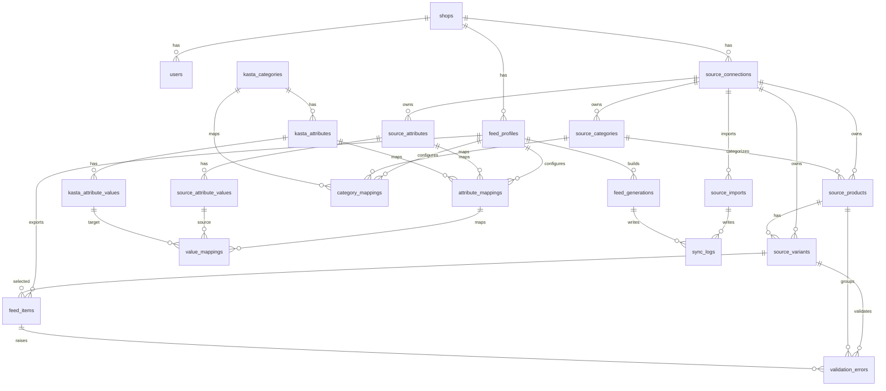

# Prom -> Kasta Feed Mediator MVP

## Assumptions

1. Один `shop` може мати кілька `source_connections` і кілька `feed_profiles`.
2. На цьому етапі один `feed_profile` працює з одним `source_connection`.
3. `Prom` є єдиним source of truth; сервіс зберігає нормалізовану read model для побудови фіда.
4. `source_products` зберігає нормалізовану картку товару, `source_variants` зберігає SKU/offer-рівень.
5. В actual-стані значення атрибутів SKU зберігаються в `source_variants.attributes_snapshot` JSON, а таблиці `source_attributes` / `source_attribute_values` є словником і mapping anchor.
6. `offer_id` фіксується на рівні `source_variants.stable_offer_id` і не перевираховується після створення запису; нестабільність відловлюється через `published_export_key_hash`.
7. XML-фід не рендериться на льоту: `FeedBuildService` створює build-файл, `FeedPublishService` публікує готовий XML у стабільний `published_path`.
8. Адмінський модуль працює через server-rendered Blade UI, session auth і `Gate::define('access-admin')`.
9. Контролери в admin-шарі залишаються thin; ручні bulk/manual операції винесені в `app/Actions/Admin`.
10. Локальна адмінська авторизація піднімається через `php artisan admin:bootstrap`.

## Flow

`SourceConnection` -> `SourceImportService` -> cached XML file -> `PromYmlParser` -> `ProductNormalizer` -> normalized tables -> `ValidationService` -> `FeedBuildService` -> `FeedGeneration` XML -> `FeedPublishService` -> public `/feeds/{token}.xml`

## Module Structure

```text
app/
  Actions/
    Admin/
  Contracts/
    Dictionaries/
    Feeds/
    Mappings/
    Source/
    Validation/
  Data/Source/
  Http/Controllers/
    Admin/
    Requests/Admin/
  Jobs/
  Models/
  Services/
    Dictionaries/
    Feeds/
    Mappings/
    Source/
    Validation/
  Support/
database/
  data/kasta/
  migrations/
  seeders/
docs/
tests/
  Feature/
  Unit/
```

## Admin Surface

```text
/admin/login
/admin
/admin/source-connections/*
/admin/feed-profiles/*
/admin/dictionaries/*
/admin/feed-profiles/{feed_profile}/category-mappings
/admin/feed-profiles/{feed_profile}/attribute-mappings
/admin/feed-profiles/{feed_profile}/value-mappings
/admin/feed-profiles/{feed_profile}/feed-items
```

### Source Connections

- CRUD for driver, source URL/path, sync interval, status and JSON settings
- manual sync action that runs import + parse + normalize synchronously in admin flow
- latest import status surfaced in list/show views

### Feed Profiles

- CRUD for publication settings and automation flags
- activate/deactivate
- manual build and publish latest generation
- public feed URL surfaced once a generation is published

### Mappings

- category mapping filters: unmapped, mapped, `rz_id`, manual, active/inactive
- bulk automap by `rz_id`
- attribute suggestion by normalized exact name
- value suggestion by normalized exact value

### Feed Items

- operational list filtered by status, mapping, vendor/article and validation code
- manual include/exclude/enable/disable/revalidate
- item details expose source snapshots, mapped data and active validation errors

## Dictionaries

- Kasta dictionaries import through `KastaDictionaryImportService`
- JSON stub source lives in `database/data/kasta`
- import and reimport are idempotent upserts
- contract details are documented in `docs/kasta-dictionary-import.md`

## ERD


